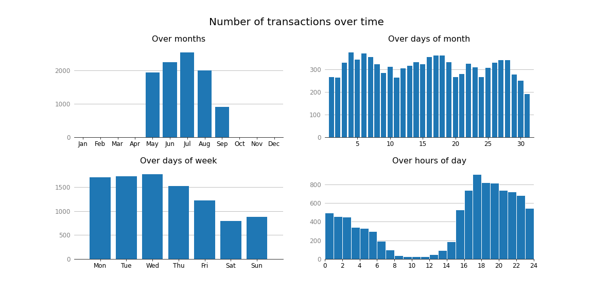

# Building product recommendation engine from Retailrocket shopping cart data

In this project, a prototype recommendation engine was developed using shopping cart data available from Kaggle's [Retailrocket recommender system dataset](https://www.kaggle.com/datasets/retailrocket/ecommerce-dataset?select=events.csv).  The gzipped version of the raw shopping "events" data file `events.csv.gz` can be found in the folder [`data`](data).  The file contains a list of three kinds of events: views, add-to-cart events, and transactions.

## Exloratory data analyis
For each transaction, a list of product items purchased was extracted from the data file by running the script [`extract_shopping_cart_data.py`](extract_shopping_cart_data.py).  The cleaned data was split into training and test data adn saved to files in the folder [`cleaned_data`](cleaned_data).  In order to keep the training time manageable, only the 3000 most-frequently purchsed product items were kept.  An exploratory analysis and visualizations of the extracted information is presented in [`EDA.ipynb`](EDA.ipynb).

## Training machine learning model
As a basis of product recommendation, the following prediction task was formulated: given the day of month, day of week, and hour of day of the transaction as well as the item(s) the customer already has placed in the shopping cart, predict for each product item the probability that the customer later will add it to the cart and purchase it.  The set of items in the cart was encoded in a 3000-dimensional vector of item counts.  A set of logistic regression models, one for each of the 3000 items (which the customer could purchase), were trained; see [`training.ipynb`](training.ipynb).  The training was done using an expanded set of data, accounting for multiple time points during the customer's shopping experience (with different number of items already pleced in the cart).  This expanded data and the trained (set of) models are saved in [`full_train_data.pickle.gz`](full_train_data.pickle.gz) and [`trained_model.pickle`](trained_model.pickle), respectively.

## Making recommendations
After the customer adds the first item to the shopping cart, the trained model is used to calculate the purchase probability of each of the 3000 pontential items from the feature vector encoding the day of month, day of week, hour of day, and the item(s) already placed in the cart.  The 3 items that has the highest (predicted) probabilities are selected as the recommendation and shown to the customer.  The model is re-run and the recommendations are updated each time the customer adds an item to the cart, while limited the number of unique recommendations per order to 5.  This process is implemented by the function `run_transaction()` in [`my_utilities.py`](my_utilities.py).

## Recommendation enegine's predictive accuracy
The accuracy can be measured by the probability that at least one of the recommendations is later
purchased in that order.  This probability was estimated by running the process above on the test data ([`hit_rate.ipynb`](hit_rate.ipynb)) and the function `hit_rate()` in [`my_utilities.py`](my_utilities.py).  The result was about 2.6%, but the probability of making any additional purchase at all is also low (about 12%; see [`prob_more_purchase.ipynb`](prob_more_purchase.ipynb)).  The conditional probability that one of the recommended item is purchased later in the shopping process given that the customer purchases more items turned out to be about 22% (≈ 0.026 / 0.12 x 100).
